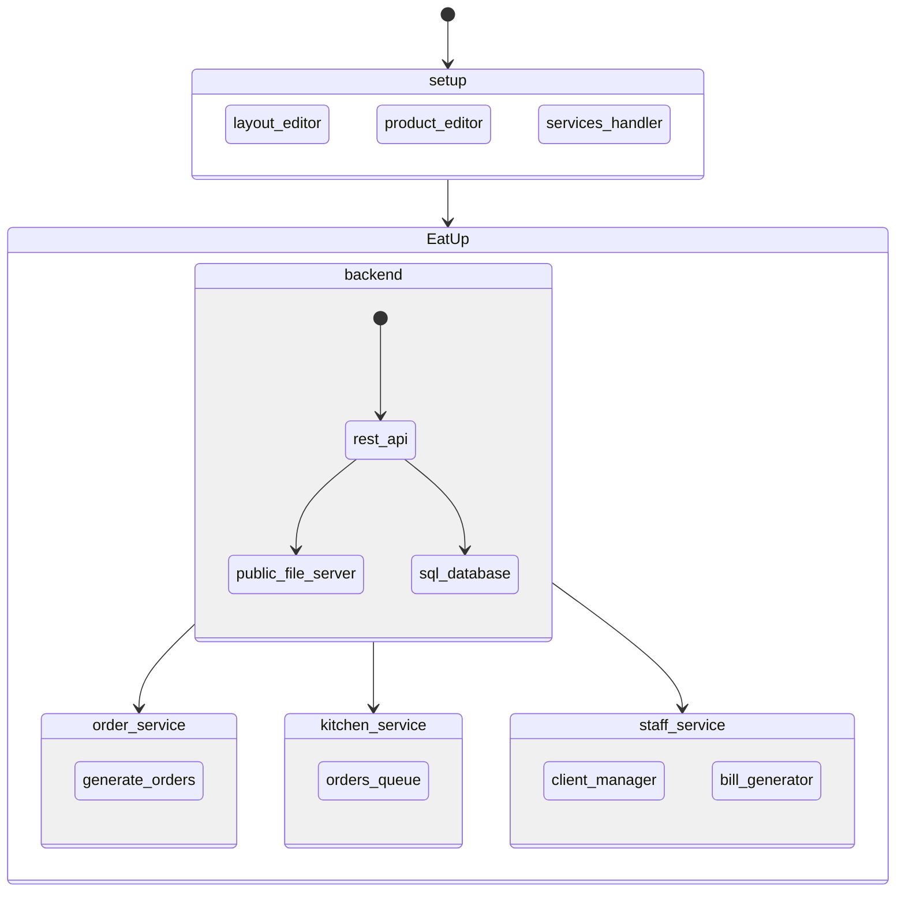
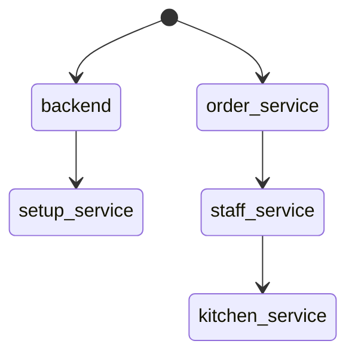

# Project description:
EatUp is a restaurant tool to automate the ordering process.

**Note**: This document describes all the services that can be implemented in this project. This is **not** a description of all the features this project will have nor the way they will be added. This is just an initial analysis of the project.

**TL;DR**: This project allows to add services on the fly and allows to dimension the project features to the needs of the restaurant.

# Project Philosophy:
- Modular structure.
- Dockerized services.
- Standard REST API.
- Documentation is key.
- Development planning is key.

# Project structure:
The project will consist of a backend and multiple-independent frontend services.

## Backend:
- Rest API
- Persistent data
  - SQL database
- Public file server
  - Images

## Services
- Order service
- Kitchen service
- Staff service
- Setup service

### Staff service:
Allows to manage the clients in the restaurant.

- Generate a new client: unique id in an available location.
- End service of a client: Create the bill.
- Gets notified when an order is ready.

### Order service:
Menu to select the dishes and drinks. The order is sent to the kitchen service.

- Requires a client id.
- Order items:
  - Multiple dishes / drinks of the same type.
  - Multiple orders at the same time.
- Allow multiple orders.

### Kitchen service:
Queues the orders and notifies the staff service when the order is ready.

- Queues the orders.
- Notifies the staff service when the order is ready.
- Removes the order from the queue when the order is ready.

**Note**: This service can be integrated in the staff service.

### Setup service:
Creates all the things needed to start running the restaurant.

- Layout editor.
- Product editor.
- Services handler.

## Application graph:

# Project development plan:
## Project development plan philosophy:
- Implement the services according to the importance of the service.
- Do not implement a low priority service if a high priority service is not implemented.
- The high priorities features in a low priority service can be implemented independently until the service is implemented.

## Project development plan:

### v0.1:
- Create project structure.

### v0.2:
- Define all the features the project will have in `v1.0`, while not forgetting the features that can be implemented in the future.
- Backend:
  - Define DB structure.
- Order service App:
  - List elements form backend needed to implement the service.

### v0.3:
- Backend:
  - Define the REST API structure.
  - Create the DB structure.
- Order service App:
  - Define interfaces.

### v0.4:
- Backend:
  - Implement the basic REST API using data from the DB.
- Order service App:
  - Implement the interfaces.

### v0.5:
- Backend:
  - Implement tools to setup the project on other devices.
- Order service App:
  - Implement the logic.

### v1.0: **Minimum viable product**
Stable version with all the previous features implemented and tested.

### v1.1:
- Staff service:
  - Define the scope of the service:
    - Is the kitchen service needed or should be integrated here?
  - Define interfaces.

### v1.2:
- Backend:
  - Implement the REST API for the staff service.
- Staff service App:
  - Implement the interfaces.

### v1.3: **New features**
- Staff service App:
  - Implement the logic.
  - Test the service.

### v1.4: **New features**
- Graphic setup service?
- Takeaways?
- Time to prepare the dishes?
- WebApp?
