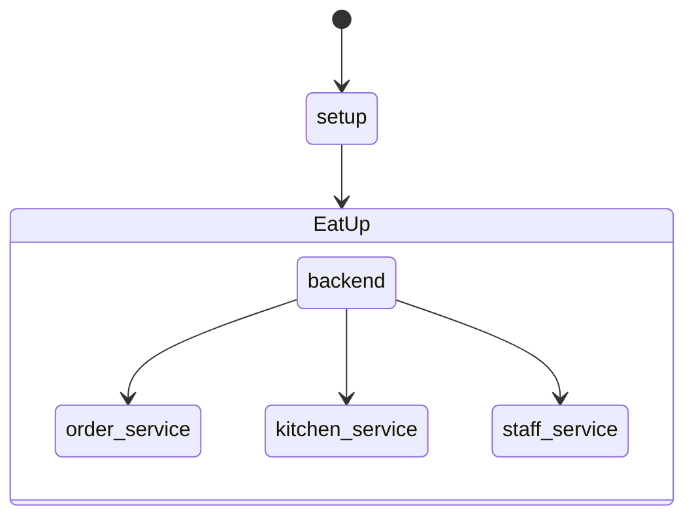

**Note**: This document describes all the services that can be implemented in this project. This is **not** a description of all the features this project will have.

# Project description:
EatUp is a restaurant tool to automate the ordering process.

# Project Philosophy:
- Modular structure.
- Dockerized services.
- Standard REST API.
- Documentation is key.
- Development planning is key.

# Project structure:
The project will consist of a backend and multiple-independent frontend services.

## Backend:
- Rest API
- Persistent data
  - SQL database
- Public file server
  - Images

## Services
- Order service
- Kitchen service
- Staff service
- Setup service

### Staff service:
Allows to manage the clients in the restaurant.

- Generate a new client: unique id in an available location.
- End service of a client: Create the bill.
- Gets notified when an order is ready.

### Order service:
Menu to select the dishes and drinks. The order is sent to the kitchen service.

- Requires a client id.
- Order items:
  - Multiple dishes / drinks of the same type.
  - Multiple orders at the same time.
- Allow multiple orders.

### Kitchen service:
Queues the orders and notifies the staff service when the order is ready.

- Queues the orders.
- Notifies the staff service when the order is ready.
- Removes the order from the queue when the order is ready.

### Setup service:
Creates all the things needed to start running the restaurant.

- Layout editor.
- Product editor.
- Services handler.

